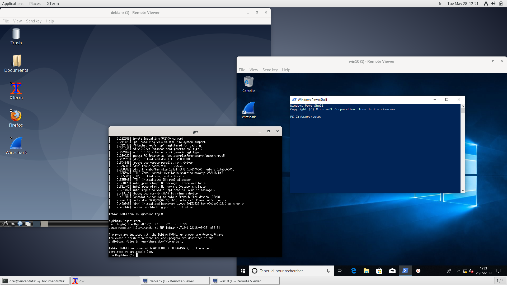

# Virtual Network with QemuNet

*QemuNet is a light shell script based on QEMU Virtual Machine (VM) and VDE Virtual Switch to enable easy Virtual Networking.*

```text
   ____                       _   _      _   
  / __ \                     | \ | |    | |  
 | |  | | ___ _ __ ___  _   _|  \| | ___| |_ 
 | |  | |/ _ \ '_ ` _ \| | | | . ` |/ _ \ __|
 | |__| |  __/ | | | | | |_| | |\  |  __/ |_ 
  \___\_\\___|_| |_| |_|\__,_|_| \_|\___|\__|
```

## QemuNet

### Quick Start

Install QemuNet and launch a simple LAN topology ([demo/lan.topo](https://github.com/orel33/qemunet/blob/master/demo/lan.topo))...

```bash
$ ./qemunet.sh -d xterm -t demo/lan.topo
```

Be patient, the system image required for this demo will be downloaded. Then, you will get 4 root consoles on Linux/Debian virtual hosts. The linux kernel booting in text/serial mode and Qemunet is using "xterm" display mode:

<center></center>

Mixing different systems and display modes are also possible. The following example shows three VMs connected as follows ```debian10x/spice <--> debian10/xterm <--> win10/spice``` ([demo/misc.topo](https://github.com/orel33/qemunet/blob/master/demo/misc.topo)) :

<center></center>

(*) For obvious reasons, win10 system image is not provided in QemuNet.

### Requirements

First of all, the QemuNet script is written in *Bash* version greater than or equal to 4. Then, you can install all the QemuNet dependencies in a Debian-like OS, as follow:

```bash
sudo apt-get install qemu qemu-kvm vde2 libattr1 libvirt0 socat rlwrap wget virt-manager libguestfs-tools libvirt-clients
```

In practice, *QemuNet* requires QEMU (qemu-system-x86_64) with VDE and KVM supports enabled and with a *version greater than or equal to 2.1*!!! Check it:

```bash
qemu-system-x86_64 --version
```

By default *QemuNet* use the KVM support, to speed up the QEMU execution. To check if KVM is well installed, you can launch the following commmand.

```bash
virt-host-validate qemu
```

If the KVM test fails, we recommand you to solve this problem before to use *QemuNet*. The -K option provided by *qemunet.sh* disables KVM, but it will be really too slow. For further details on KVM: https://wiki.archlinux.org/index.php/KVM

### Download & Install

QemuNet is a free software distributed under the terms of the GNU General Public License (GPL) and it is available for download on [GitHub](https://github.com/orel33/qemunet).

Let's download it:

```bash
git clone https://github.com/orel33/qemunet.git
```

The main QemuNet files are described below:

```text
qemunet
  ├── demo/         <-- some basic examples of topology
  ├── images/       <-- default empty directory to store system images
  ├── qemunet.cfg   <-- the default qemunet configuration file
  ├── qemunet.sh    <-- main qemunet script
  └── README.md     <-- this file
```

By default, the *images* directory is empty. The default system images (described in *qemunet.cfg*) will be automatically download by the QemuNet script at first use. The default *QemuNet* images are available [here](http://aurelien.esnard.emi.u-bordeaux.fr/qemunet/).

### Test

You can easily test a system already available in QemuNet (check *qemunet.cfg*), as follow:

```bash
./qemunet.sh -l tinycore -i   # Linux TinyCore
./qemunet.sh -l debian -i     # Linux Debian
```
  
### Let's start with a basic LAN

You will find several examples in the *demo* subdirectory. But, let's start with a basic LAN topology.

First, you need to prepare a virtual topology file, as for example [demo/lan.topo](https://raw.githubusercontent.com/orel33/qemunet/master/demo/lan.topo). It describes a LAN with 4 *debian* Virtual Machines (VM), named *host1* to *host4* and one Virtual Switch (VS) named *s1*. The *debian* system must refer to a valid system in the *QemuNet* configuration file [qemunet.cfg](https://raw.githubusercontent.com/orel33/qemunet/master/qemunet.cfg).

```bash
# SWICTH switchname
SWITCH s1
# HOST sysname[/displaymode] hostname switchname0 switchname1 ...
HOST debian host1 s1
HOST debian host2 s1
HOST debian host3 s1
HOST debian host4 s1
```

Here is an example of the *QemuNet* configuration file *qemunet.cfg*. It requires to provide a valid Debian image for QEMU. Optionnaly, you will need to extract the kernel files (initrd & vmlinuz) from this image, as explained later. 

```bash
IMGDIR="/absolute/path/to/raw/system/images"
SYS[debian]="linux"
QEMUOPT[debian]="-m 512"
FS[debian]="$IMGDIR/debian/debian.img"
KERNEL[debian]="$IMGDIR/debian/debian.vmlinuz"
INITRD[debian]="$IMGDIR/debian/debian.initrd"
URL[debian]="http://aurelien.esnard.emi.u-bordeaux.fr/qemunet/debian.tgz"
```

Following, you can launch your Virtual Network (VN). All the current session files are provided in the *session* directory, that is linked to a unique directory in /tmp.

```bash
./qemunet.sh -t demo/lan.topo
```

Once you have finish your work, halt all machines properly with "poweroff" command. Thus, you are sure that all VM disks are up-to-date. 

If you want to restore your session from the current session directory, you can simply type:

```bash
./qemunet.sh -S session
```

In order to save your session, you need to save all session files in a tgz archive.

```bash
cd session ; tar cvzf lan.tgz * ; cd ..
```

So, you will be able to restore your session later as follow:

```bash
./qemunet.sh -s lan.tgz
```

For instance, if you modify the system files of the VM *host1*, those modifications will not modify directly the raw system image *debian.img* (provided in *qemunet.cfg*), but it will store it the file *session/host1.qcow2*.

In addition, we use a startup script to load a user-defined script "/mnt/host/start.sh", that is stored in the file *session/<hostname>/start.sh*. It is a flexible way to setup each VM without modifying the raw system image or using the qcow2 files (that depends on the raw image). For instance, you can start the LAN demo with all IPs and hostnames well configured:

```bash
./qemunet.sh -x -s demo/lan.tgz
```

### Other Examples

Other samples are available in the [demo](https://github.com/orel33/qemunet/tree/master/demo) subdirectory, as for instance:

* [demo/single.topo](https://raw.githubusercontent.com/orel33/qemunet/master/demo/single.topo) : a basic single "debian" VM (no network)
* [demo/lan.topo](https://raw.githubusercontent.com/orel33/qemunet/master/demo/lan.topo) : a LAN of 4 "debian" VMs interconnected by a switch
* [demo/chain.topo](https://raw.githubusercontent.com/orel33/qemunet/master/demo/chain.topo) : a chain of 5 "debian" VMs interconnected by 4 switches
* [demo/gw.topo](https://raw.githubusercontent.com/orel33/qemunet/master/demo/gw.topo) : an example of LAN with a gateway connected to an external LAN
* [demo/dmz.topo](https://raw.githubusercontent.com/orel33/qemunet/master/demo/dmz.topo) : a more complex topology with two internal LANs (including a DMZ)
* [demo/vlan.topo](https://raw.githubusercontent.com/orel33/qemunet/master/demo/vlan.topo) : a basic LAN divided in two VLANs
* [demo/trunk.topo](https://raw.githubusercontent.com/orel33/qemunet/master/demo/trunk.topo) : two VLANs with trunking

### How to upgrade an image used by QemuNet?

For instance, if you want to install new packages in the "debian" image, you can do it easily like this:

```bash
./qemunet.sh -L debian -i
```

Then, in the VM, start network and install whatever you want:

```bash
dhclient eth0   # Internet access via Slirp interface of QEMU (no ping)
apt-get install package1 package2 ...
# ...
rm /etc/resolv.conf
history -c
```

Be careful, all the modifications will be saved definitely in the raw image of the system, i.e. in the file *images/debian/debian.img*.

### Manual

QemuNet is based on a single bash script *qemunet.sh*. Here are detailed available options for this command:

```text
Start/restore a session:
  qemunet.sh -t topology [-a extra.tgz] [...]
  qemunet.sh -s session.tgz [...]
  qemunet.sh -S session/directory [...]
Options:
    -t <topology>: network topology file
    -s <session.tgz>: load session from an archive
    -S <session directory>: load session from a directory
    -h: print this help message
Advanced Options:
    -a <extra.tgz>: decompress an extra archive in session directory
    -c <config>: load system config file (default is qemunet.cfg)
    -x: launch VM in xterm terminal (only for linux system running on ttyS0)
    -d <display mode>: launch VM with special display mode: 
       * graphic: standard QEMU display mode (default mode)
       * xterm: QEMU serial/text mode running within xterm (same as -x option)
       * rxvt: same as xterm mode, but using rxvt instead
       * gnome: same as xterm mode, but using gnome-terminal instead
       * xfce4: same as xterm mode, but using xfce4-terminal instead
       * tmux: QEMU serial/text mode running within a tmux session (experimental)
       * screen: QEMU serial/text mode running within a screen session (experimental)
       * vnc: use QEMU VNC display (experimental)
       * spice: use QEMU SPICE display (experimental)
       * none: no graphic (experimental)
More Advanced Options:
    -l <sysname>: launch a VM in standalone mode to test it...
    -L <sysname>: launch a VM in standalone mode using raw disk image (warning: image will be modified)
    -D <sysname>: download system image from URL provided in config file
    -b: run qemunet as a background command
    -m: mount directory <session directory>/<hostname> using 9p/virtio with 'host' tag (default, linux only)
    -M: disable mount directory
    -f: mount extra disk <session directory>/<hostname>.disk (default)
    -F: disable mount disk
    -k: enable an accelerator: kvm, hvf (default)
    -K: disable accelerator (not recommanded, too slow)
    -v: enable VLAN support
    -V: start remote viewer(s) for VNC or SPICE display mode
    -y: launch VDE switch management console in terminal
    -i: enable QEMU Slirp interface for Internet access (ping not allowed)
    -z <args>: append linux kernel arguments (linux only)
```

### Configuration of QemuNet

Once you have download QemuNet, you need first to set the runtime commands for QEMU and VDE in *qemunet.sh*, if they don't use the default directory.

```bash
QEMU="/usr/bin/qemu-system-x86_64"
QEMUIMG="/usr/bin/qemu-img"
VDESWITCH="/usr/bin/vde_switch"
```

Then, you have to provide a configuration file that defines several virtual systems and its parameters (name, type, disk image file, ...). The default configuration file is *[qemunet.cfg](https://raw.githubusercontent.com/orel33/qemunet/master/qemunet.cfg). It is a bash script that uses associative arrays (bash 4 or greater required). Here is a template file:

```bash
# IMGDIR="/absolute/path/to/raw/system/images"
IMGDIR=$(realpath images)

SYS[sysname]="linux|windows|..."
QEMUOPT[sysname]="qemu extra options"
FS[sysname]="/absolute/path/to/raw/system/sysname.img"
KERNEL[sysname]="/absolute/path/to/system/sysname.vmlinuz"  # optional, required for -x option
INITRD[sysname]="/absolute/path/to/system/sysname.initrd"   # optional, required for -x option
URL[sysname]="http://url/where/to/find/sysname.tgz"         # optional, url to download sysname.tgz (including FS, KERNEL and INITRD)
```

The SYS and FS arrays are required for each system. They respectively define the system type (linux, windows, ...) and the QEMU disk image file (in raw format). QEMUOPT can be used to pass additional options to QEMU when launching the VM, as for instance cpu type or max memory. See QEMU documentation for detailed options. Both KERNEL and INITRD are optional for linux system, but required if you want to launch the VMs in xterm (option -x).

### How to use my own image in QemuNet?

Instead of using the default repository for QemuNet *images* (available [here](http://aurelien.esnard.emi.u-bordeaux.fr/qemunet/)), you should prefer to install your own images in the *images* subdirectory (or elsewhere). In this case, you will need to update the configuration file provided in *qemunet.cfg*.
Please visit this [wiki](http://aurelien.esnard.emi.u-bordeaux.fr/teaching/doku.php?id=qemunet:index) for further details.

### VLAN support in QemuNet

You can start to have a look in the "vlan" and "trunk" samples provided in demo/ :

```bash
./qemunet.sh -v -x -y -s demo/vlan.tgz
./qemunet.sh -v -x -y -s demo/trunk.tgz  # see TRUNK keyword in topology file
```

The "-v" option is required to enable VLAN support in QemuNet. The "-y" option starts the VDE switch management console. See documentation [here](http://wiki.virtualsquare.org/wiki/index.php/VLAN_trunking) to know how to configure your VLAN on a VDE switch. It is also possible to provide a file named "switchname.cmd" in the session directory that will be load by the VDE switch at boot time.

### Documentation

* QEMU: http://wiki.qemu.org
* QEMU Networking: http://wiki.qemu.org/Documentation/Networking
* VDE: http://vde.sourceforge.net/
* VDE Manual : http://wiki.virtualsquare.org/wiki/index.php?title=VDE
* Tutorial VDE : http://wiki.virtualsquare.org/wiki/index.php?title=VDE_Basic_Networking

### Other Solutions

* NEmu : http://nemu.valab.net/ 
* MarionNet : http://www.marionnet.org/EN/
* User Mode Linux: http://user-mode-linux.sourceforge.net
* GNS3: https://www.gns3.com

## Tips

* To get the QEMU [Monitor](https://en.wikibooks.org/wiki/QEMU/Monitor) console in serial mode, type *Ctrl+A C*.... Then type *help* to get the command list (system_reset, system_powerdown, ...).
* In case of hard failure with a VM (killed, halted, ...), you can restart it using the script named *hostname.sh* in the session directory!

## QemuNet Web

I am currently working on a web extension of QemuNet based on:

* QemuNet topology launch via Node.JS for backend...
* Web browser running multiple Xterm.js for frontend...
* Real-time communication based on web socket (socket.io) between the two sides...

The idea is to give my students an easy solution to use Virtual Network @ Home and to learn network easily ;-)

Follow branch qemunetweb on github.

### Contact Me

<mailto:aurelien.esnard@u-bordeaux.fr>
